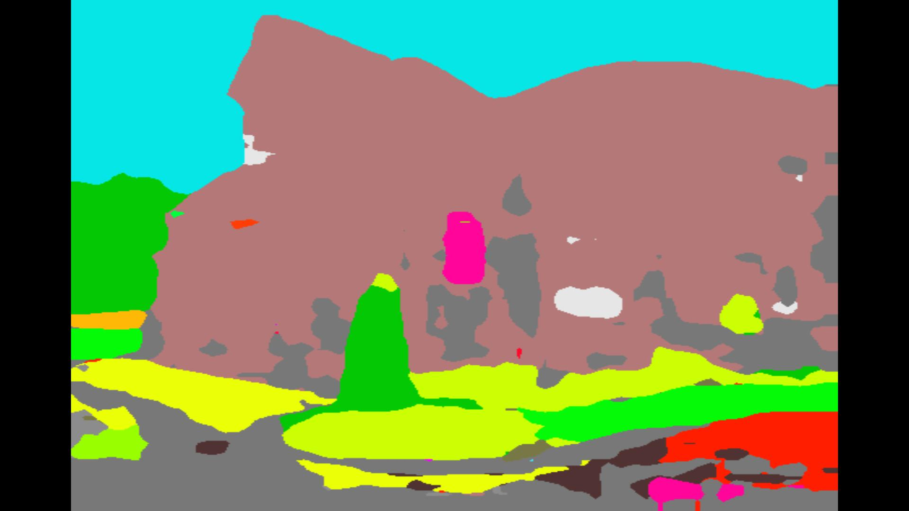
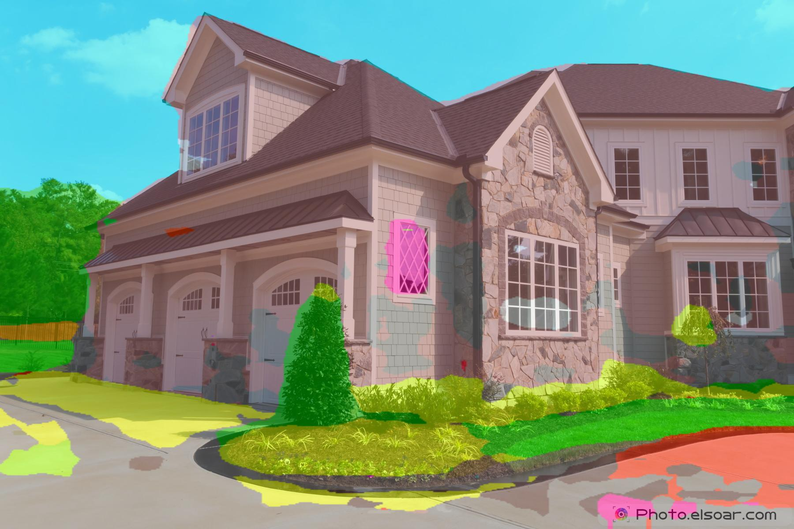
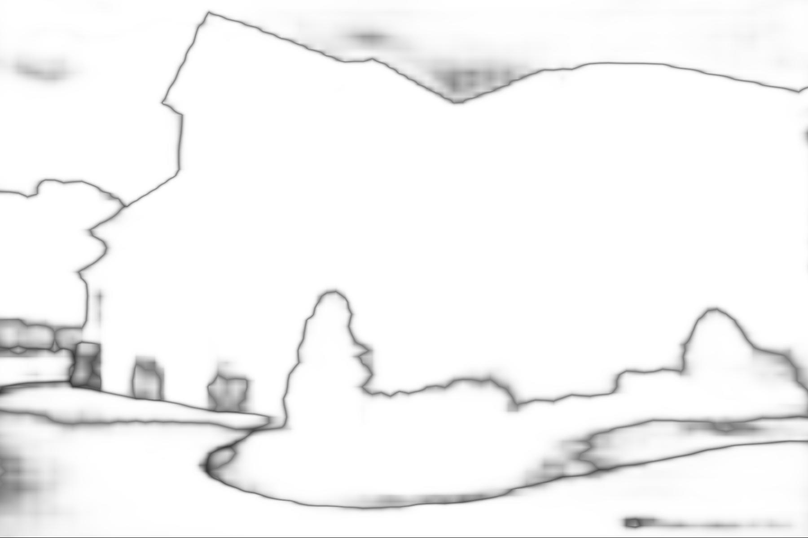

# Keras implementation of [PSPNet(caffe)](https://github.com/hszhao/PSPNet)

Implemented Architecture of Pyramid Scene Parsing Network in Keras.

Converted trained weights are needed to run the network.

Weights of the original caffemodel can be converted with weight_converter.py as follows:

```bash
python weight_converter.py <path to .prototxt> <path to .caffemodel>
```

Running this needs the compiled original PSPNet caffe code and pycaffe.
Already converted weights can be downloaded here:

[pspnet50_ade20k.npy](https://www.dropbox.com/s/ms8afun494dlh1t/pspnet50_ade20k.npy?dl=0)
[pspnet101_cityscapes.npy](https://www.dropbox.com/s/b21j6hi6qql90l0/pspnet101_cityscapes.npy?dl=0)
[pspnet101_voc2012.npy](https://www.dropbox.com/s/xkjmghsbn6sfj9k/pspnet101_voc2012.npy?dl=0)

weights should be placed in the directory with pspnet.py

The interpolation layer is implemented as custom layer "Interp"

## Important

Results Keras:






## Pycaffe result

## Dependencies:
1. Tensorflow
2. Keras
3. numpy
4. pycaffe(PSPNet)(optional for converting the weights)


## Usage:

```bash
python pspnet.py --input-path INPUT_PATH --output-path OUTPUT_PATH
```
