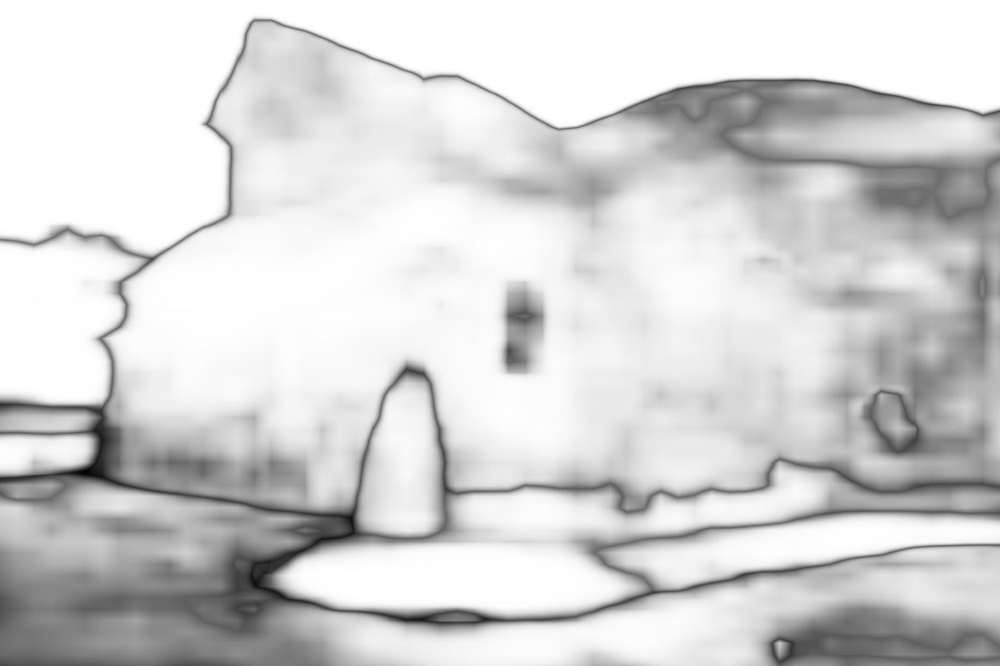

# Keras implementation of [PSPNet(caffe)](https://github.com/hszhao/PSPNet)

Implemented Architecture of pyramid scene parsing network in Keras

Converted trained weights needed to run the network.


Download converted weights here:
[link:pspnet50_ade20k.npy](https://www.dropbox.com/s/ms8afun494dlh1t/pspnet50_ade20k.npy?dl=0)

And place in directory with pspnet50_ade20k.npy

Weights from caffemodel were converted by, weight_converter.py. The usage of this file is
```bash
python weight_converter.py <path to .prototxt> <path to .caffemodel>
```
Running this need to compile the original PSPNet caffe code and pycaffe. 

Interpolation layer is implemented in code as custom layer "Interp"

## Important

Results Keras:




## Pycaffe result

## Dependencies:
1. Tensorflow
2. Keras
3. numpy
4. pycaffe(PSPNet)(optional)


## Usage: 

```bash
python pspnet.py --input-path INPUT_PATH --output-path OUTPUT_PATH
```

